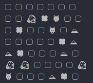
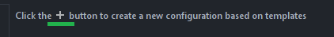
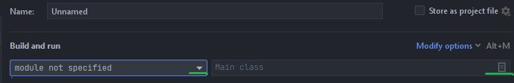

## Проект Симуляция 2D мира

Проект с консольным выводом информации. 

При запуске приложения происходит расстановка сущностей на карте. Сущности представлены в виде Скалл, Травы, Травоядных и Хищников. 

**Процесс симуляции:**
Травоядные на каждом ходе ищут траву, чтобы её съесть, хищники ищут травоядных, чтобы съесть их. Проход через скалы, травоядных и хищников невозможен. 
 
**Окончание симуляции**:** Симуляция будет окончена после того как все травоядные будут съедены хищниками или при принудительном завершении через ввод команды. 

**Для запуска приложения необходимо:**
1. Наличие установленного пакета jdk, Git Bash и среды разработки IntellijIdea
2. Скопируйте URL репозитория
3. Выполните команду git clone URL репозитория
4. В Intelji выберите File -> New -> Project from Existings Sources
5. Откроется окно импорта проекта, выберите клонированную директорию, и нажимайте Next до окончания импорта, на последнем шаге откройте проект.
6. Далее необходимо выбрать Add Configuration
7. Нажмите на  
8. В сплывающей боковой панели выбрать Application 
9. Задайте имя проекту, выберите установленный jdk и класс для запуска приложения(класс определиться автоматически)
10. Нажмите Apply и Ок, конфигурация проекта завершена, для запуска проекта нажмите Shift+F10
